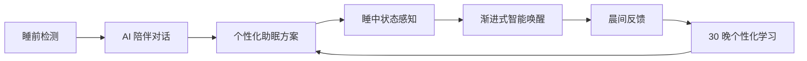

<div align="center">

# Somnus AI

### 让床品从被动承托，变成主动理解你的睡眠接口

**AI 睡眠助手 + 床品接口**，把睡前对话、生理感知、助眠干预、智能唤醒和长期学习连接成一个完整闭环。

[](https://github.com/lexiaox/somnus-ai/actions/workflows/pages.yml)


[在线体验](https://lexiaox.github.io/somnus-ai/) · [产品逻辑](#产品闭环) · [本地运行](#本地运行)

`#adventurex2026` · `Hack the Rest`

</div>

---

## 为什么是 Somnus AI

很多睡眠产品擅长记录，却很少在用户真正睡不着时采取行动。Somnus AI 不只回答“昨晚睡得怎么样”，而是尝试解决三个更直接的问题：

- **现在为什么睡不着？** 将床品传感数据与低刺激 AI 对话结合，识别孤独、工作反刍和环境刺激。
- **今晚能做什么？** 把判断转化为呼吸、冥想、环境声音和床品反馈组成的个性化方案。
- **下一晚如何更好？** 从连续睡眠数据中学习个人规律，验证干预效果并调整下一晚策略。

> 当前版本是 AdventureX 2026 蓝盒子「Hack the Rest」赛道 Web Demo。生理数据与长期学习结果均为合理范围内的模拟数据，不构成医疗诊断。

## 在线体验

访问 **[Somnus AI Web Demo](https://lexiaox.github.io/somnus-ai/)**，约 3 分钟可体验完整流程。

GitHub Pages 为纯静态演示环境，因此对话使用前端本地意图分析；通过本地 `server.py` 启动时，可安全调用 DeepSeek API，API Key 不会进入浏览器或仓库。

## 产品闭环



1. **睡前检测**：模拟枕头与床垫采集心率、HRV、呼吸、体动、光线和噪声。
2. **AI 对话分析**：用低刺激对话理解生理信号背后的孤独感、压力和认知反刍。
3. **交互助眠方案**：动态组合身体扫描冥想、呼吸节奏、环境声音和灯光建议。
4. **睡眠进行**：通过压缩时钟、阶段动画和数据趋势表达整晚状态变化。
5. **智能唤醒**：在最晚起床时间前寻找浅睡窗口，用光线、声音和触觉渐进唤醒。
6. **长期学习**：用固定种子的 30 晚历史数据展示趋势、影响因子、干预收益和明晚预测。

## 核心亮点

| 能力 | Demo 表达 | 产品价值 |
| --- | --- | --- |
| 床品数据接口 | 六类实时模拟传感数据与趋势图 | 让枕头和床垫成为无感数据入口 |
| AI 睡前陪伴 | DeepSeek / 本地双模式对话与结构化分析 | 同时理解“发生了什么”和“为什么” |
| 主动助眠干预 | 可交互冥想、呼吸、声音和环境控制 | 从监测走向可执行方案 |
| 智能渐进唤醒 | 浅睡窗口判断与 18 秒唤醒演示 | 降低粗暴闹钟带来的睡眠惯性 |
| 个性化学习 | 30 晚趋势、影响因子和方案前后对比 | 让系统随着使用逐渐更懂用户 |

## 技术架构

```text
床品接口模拟器 ─┐
                 ├─> 前端状态判断 ─> 助眠策略 ─> 睡眠与唤醒 Demo
睡前 AI 对话 ───┘          │
                            └─> 晨间反馈 ─> 个性化学习可视化

浏览器 ──POST /api/chat──> Python 安全代理 ──> DeepSeek API
```

- 前端：原生 HTML、CSS、SVG 与 JavaScript，无图表库依赖。
- 后端：Python 标准库 HTTP 服务，用于静态资源与 DeepSeek API 安全代理。
- 数据：固定种子的生理数据与 30 晚睡眠历史，确保每次路演结果一致。
- 部署：GitHub Actions 自动发布纯静态版本到 GitHub Pages。

## 本地运行

### 仅体验静态 Demo

直接打开 `index.html`。系统会自动使用本地对话策略，不需要 API Key。

### 启用真实 DeepSeek 对话

准备 Python 3.10+ 和一个有效的 DeepSeek API Key。密钥只通过环境变量注入，不要写入任何项目文件。

```powershell
$env:DEEPSEEK_API_KEY="your-new-api-key"
python server.py
```

浏览器访问：

```text
http://127.0.0.1:4173
```

## 安全与边界

- 浏览器只请求本地 `/api/chat`，不会接触 DeepSeek API Key。
- 服务端限制请求体、对话条数与单条消息长度。
- 明显的紧急安全风险词由本地策略优先处理，不等待模型回复。
- 产品用于睡眠体验与行为建议，不提供医疗诊断。

## 项目状态

当前聚焦夜间睡眠 Web Demo。下一阶段计划包括真实硬件协议、移动端 App、历史账号体系和真实个性化模型。

如果你对睡眠硬件、可穿戴设备、声音设计或个性化 AI 感兴趣，欢迎提交 Issue 交流。

---

<div align="center">
Built for <strong>AdventureX 2026 · Hack the Rest</strong><br>
让每一次休息，都成为系统更懂你的下一次机会。
</div>
